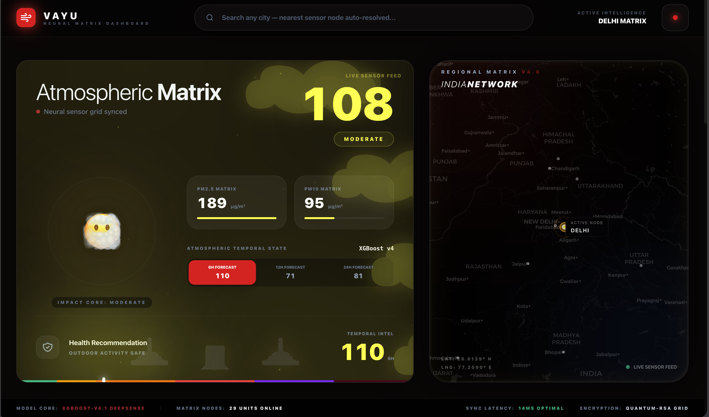
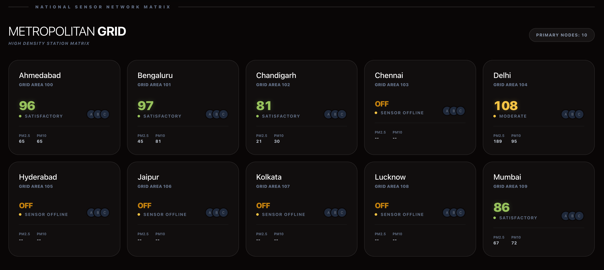
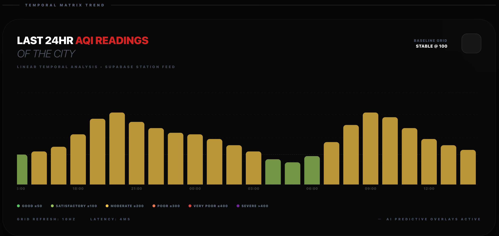
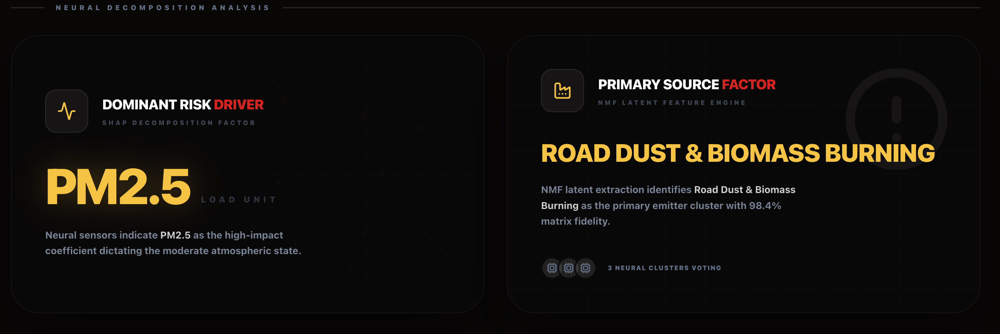

<p align="center">
  
</p>

<h1 align="center">Vayu - Air Quality Intelligence System</h1>

<p align="center">
  
  
  
  
  
  
  
  
</p>

A production-grade, end-to-end air quality forecasting system for 29 Indian cities. Vayu combines a live data pipeline, XGBoost-based ML models, SHAP explainability, and NMF source attribution into a FastAPI backend and React dashboard.

---

**Models:** XGBoost | Random Forest | SHAP | NMF  
**Stack:** FastAPI | React | Supabase | GitHub Actions

---

## UI Overview

### Landing Dashboard
The main dashboard displays real-time AQI for the selected city, including current pollutant levels (PM2.5, PM10, CO, NO2, SO2, O3), forecast cards for 6h/12h/24h windows, and an atmospheric background that adapts to air quality severity.



### Multi-City Sensor Grid
The national network grid shows AQI readings across all 29 supported Indian cities in a scrollable card layout, enabling quick comparison of air quality nationwide.



### Historical Trends
The last 24-hour readings chart visualizes temporal AQI patterns using bar charts, helping users identify daily patterns and pollution spikes.



### Forecast Explanation
SHAP-based explanations break down forecast contributions by feature, showing how each pollutant and time feature impacts the predicted AQI value.



---

## Overview

Vayu is an end-to-end air quality forecasting system that combines multiple live data sources with machine learning to deliver accurate, interpretable AQI predictions across Indian cities.

**Data sources:**
- WAQI API — multi-station search endpoint aggregates readings from all stations in a city; the backend takes their median as the authoritative display AQI, avoiding the noise of any single sensor.
- OpenWeather Air Pollution API — provides raw pollutant concentrations (PM2.5, PM10, CO, NO2, SO2, O3) in µg/m³, which are the actual model input features.

**ML pipeline:**
- XGBoost regressors trained on 846k hourly readings predict AQI at +6h, +12h, and +24h horizons.
- XGBoost classifier maps current pollutant levels to CPCB's 6-category scale (Good → Severe).
- SHAP TreeExplainer provides per-prediction feature attribution, showing which pollutant drove each forecast.
- NMF (Non-negative Matrix Factorization) decomposes the pollutant matrix into latent source profiles, enabling city-level pollution source attribution.

The system runs hourly via GitHub Actions, persists data in Supabase, and serves predictions through a FastAPI backend consumed by a React + TypeScript dashboard.

---

## Architecture

```
WAQI API (search endpoint)      →  Multi-station median AQI (display value)
OpenWeather Air Pollution API   →  Pollutant concentrations (model input features)
GitHub Actions (cron: hourly)   →  Fetches + stores to Supabase aqi_data table
Supabase                        →  Persistent storage + lag feature retrieval
FastAPI                         →  ML inference, CPCB AQI computation, REST API
React + TypeScript              →  Interactive dashboard
```

The data pipeline and the inference backend are intentionally decoupled. GitHub Actions writes one row per city per hour into Supabase. At inference time, the FastAPI backend reads the latest Supabase row for lag features (AQI_lag_1, AQI_lag_6, AQI_lag_24), fetches a live WAQI reading for the display AQI, and constructs the feature vector in memory — no file I/O at request time.

---

## Data Pipeline

1. **GitHub Actions** triggers hourly on `cron: '0 * * * *'`.
2. For each of the 29 cities, the pipeline hits the WAQI search endpoint, collects AQI values from all stations returned, and stores the median. This avoids the volatility of single-station readings.
3. It simultaneously hits the OpenWeather Air Pollution API using hardcoded city coordinates to fetch PM2.5, PM10, CO, NO2, SO2, O3 concentrations in µg/m³.
4. The row — city, datetime, AQI, six pollutant columns, and derived time features (hour, month, day_of_week, is_weekend) — is inserted into the `aqi_data` Supabase table.
5. At inference time, the FastAPI backend queries Supabase for the latest row and computes lag features directly from the stored AQI history, with forward-fill for any missing hours.

---

## Notebooks

The four notebooks in `notebooks/` are the complete, reproducible training pipeline. Running them in order regenerates every model artifact from scratch. Pretrained models are available on HuggingFace (see [Models](#models) below) if you want to skip training.

| Notebook | Purpose | Key outputs |
|---|---|---|
| `01_eda_and_cleaning.ipynb` | EDA, anomaly detection, data cleaning, feature selection, dataset splits | `master_cleaned.csv`, `city_encoder.pkl`, `scaler.pkl`, classification and regression CSVs |
| `02_forecaster.ipynb` | Lag feature engineering, XGBoost regressor training for +6h/+12h/+24h, evaluation vs. RF baseline | `xgb_6h.pkl`, `xgb_12h.pkl`, `xgb_24h.pkl`, `features.pkl` |
| `03_classifier.ipynb` | Random Forest and XGBoost classifier training, class-level evaluation, model selection | `rf_classifier.pkl`, `xgb_classifier.pkl`, `best_classifier.pkl`, `classifier_metadata.json` |
| `04_shap_nmf_attribution.ipynb` | SHAP city-level profiles, NMF pollutant source decomposition, explainer serialisation | `shap_explainer_*.pkl`, `nmf_model.pkl`, `nmf_scaler.pkl`, `shap_city_profiles_*.csv` |

### What notebook 01 does

The raw dataset (`aqi_india_38cols_knn_final.csv`, 846,372 rows, 29 cities, 2015–2024, hourly) was downloaded from HuggingFace at `rachitgoyell/vayu-raw`. Intentional anomalies were introduced to simulate real-world ingestion issues: ~0.5% random NaN per column, ~0.5% duplicate rows, sentinel value `999` in `co_ugm3`, and US EPA category labels instead of CPCB.

Cleaning steps in order:
- Replace sentinel 999 → NaN
- Physical range validation (nulls readings outside plausible atmospheric bounds)
- Parse datetime, sort by city + datetime
- Forward-fill short gaps (limit=3 hours, per city group)
- Drop rows where all six pollutants are simultaneously NaN
- Deduplicate on (city, datetime), keep first
- Remap US EPA labels to CPCB via a fixed category map: Unhealthy for Sensitive → Poor, Unhealthy → Very Poor, Very Unhealthy → Severe, Hazardous → Severe

Feature selection used two passes: a pairwise correlation filter (drops features with r > 0.85) followed by Random Forest importance thresholding (drops features below 0.02 importance). The retained feature set is stored in `FINAL_FEATURES`.

### What notebook 02 does

The CPCB AQI formula is piecewise linear — it takes the maximum of six sub-indices, each computed from a breakpoint table. Linear regression cannot model the `max` operation, which is why the baseline achieved only R²=0.585, RMSE=45.14 on the test set. Notebook 02 adds lag features (AQI_lag_1, AQI_lag_6, AQI_lag_24) computed per city group, creates three target columns (AQI_next_6, AQI_next_12, AQI_next_24) via `.shift()`, applies log1p transformation to pollutant columns, and performs a chronological 80/20 split — no shuffling, to respect the time series structure.

Three XGBoost regressors are trained, one per horizon, with `n_estimators=300` and `learning_rate=0.05`. Random Forest regressors are also trained for comparison but not deployed (see model selection rationale below).

---

## Model Selection: XGBoost vs. Random Forest

Both models were evaluated across all three forecast horizons and for classification. The decision to deploy XGBoost exclusively came from two independent lines of reasoning that pointed in the same direction.

### For the classifier

Random Forest achieved 79.3% weighted accuracy vs. XGBoost's 74.5%. The gap is real but misleading. It is almost entirely driven by the Moderate class (AQI 101–200), which comprises 45.8% of the test set. RF correctly classifies 84.0% of Moderate readings vs. XGBoost's 68.6%, and because Moderate dominates the weighted average, that single class swings the headline number.

On the clinically important Poor class (AQI 201–300 — the threshold above which CPCB issues public health advisories and recommends vulnerable populations stay indoors), XGBoost recall is 71.1% vs. RF's 66.5%. XGBoost is the more reliable model on the predictions that matter most for public health. It also has substantially better recall on the Good class (90.1% vs. 81.6%), meaning it is less likely to trigger a false alarm on clean-air days.

| Class | Support | RF Recall | XGB Recall | Clinical weight |
|---|---|---|---|---|
| Good | 26,891 | 81.6% | 90.1% | Low |
| Moderate | 76,029 | 84.0% | 68.6% | Medium |
| Poor | 34,508 | 66.5% | 71.1% | High |
| Very Poor | 28,496 | 80.2% | 79.9% | High |

### For the forecaster

Both models achieve similar short-term accuracy at +6h. XGBoost outperforms Random Forest at +12h. RF shows marginally lower RMSE at +24h — but the difference is within noise given the uncertainty at that horizon.

### The deployment constraint

RF's serialised classifier is ~3 GB. RF's three regressor files together approach 9 GB. XGBoost's equivalents are approximately 5 MB each — a 560x difference for the classifier alone. On a hosted backend such as Render's free tier, a 3 GB model artifact means cold-start latency of 30–60 seconds minimum and likely memory limit breaches. A model that cannot serve a request within a reasonable latency window is not a better model in any practical sense.

XGBoost was therefore selected for all deployed endpoints: better recall on the clinically important minority classes, and the only option that is actually deployable. The RF models are trained and evaluated in the notebooks for completeness and can be inspected there.

### Why XGBoost outperforms linear regression by design

Random Forest trains 200 fully independent trees in parallel, each on a bootstrapped sample of the 663k training rows with no depth limit. On a dataset with only 6 pollutant features plus temporal and lag features, each tree grows extremely deep and memorises fine-grained decision boundaries. The ensemble vote is robust because trees are decorrelated by random feature subsampling at each split.

XGBoost builds trees sequentially, with each new tree correcting the residual error of the previous one, but applies heavy regularisation throughout: `learning_rate=0.05` means each tree contributes only 5% of its weight to the final prediction, `max_depth=6` caps tree complexity, and `subsample=0.8` means each tree only sees 80% of rows. These constraints prevent overfitting and force the model to learn gradually. On this dataset they cost approximately 4.8 percentage points of classification accuracy relative to RF's unconstrained memorisation — a trade-off that is well worth the deployment advantages.

---

## Models

Pretrained model artifacts are hosted at [rachitgoyell/vayu-models](https://huggingface.co/rachitgoyell/vayu-models) on HuggingFace. Download them into your local `models/` directory to run the backend without retraining.

```
models/
├── encoders/
│   ├── city_encoder.pkl         # LabelEncoder for 29 city names (0–28)
│   ├── features.pkl             # Ordered feature list shared across notebooks
│   └── nmf_scaler.pkl           # MinMaxScaler for NMF pollutant preprocessing
├── forecaster/
│   ├── xgb_6h.pkl               # XGBoost Regressor — +6h AQI forecast
│   ├── xgb_12h.pkl              # XGBoost Regressor — +12h AQI forecast
│   └── xgb_24h.pkl              # XGBoost Regressor — +24h AQI forecast
├── classifier/
│   ├── xgb_classifier.pkl       # XGBoost Classifier — CPCB 6-category
│   ├── best_classifier.pkl      # Deployed model (copy of xgb_classifier)
│   └── classifier_metadata.json # Label maps, class names, evaluation metrics
└── shap/
    ├── shap_explainer_6h.pkl    # SHAP TreeExplainer for +6h model
    ├── shap_explainer_12h.pkl   # SHAP TreeExplainer for +12h model
    ├── shap_explainer_24h.pkl   # SHAP TreeExplainer for +24h model
    └── nmf_model.pkl            # NMF model for pollutant source attribution
```

The backend's `lifespan` handler loads models once at startup into a shared `models` dict. All request handlers read from this dict — no per-request disk I/O.

---

## Reproducing Models from Scratch

If you prefer to train locally rather than downloading pretrained artifacts:

```bash
# 1. Download the raw dataset
#    Source: https://huggingface.co/datasets/rachitgoyell/vayu-raw
#    Place the CSV at: data/raw/aqi_india_38cols_knn_final.csv

# 2. Run notebooks in order
jupyter notebook notebooks/01_eda_and_cleaning.ipynb
jupyter notebook notebooks/02_forecaster.ipynb
jupyter notebook notebooks/03_classifier.ipynb
jupyter notebook notebooks/04_shap_nmf_attribution.ipynb
```

Each notebook saves its outputs to `data/cleaned/` and `models/` automatically. Notebook 04 depends on the XGBoost regressors from notebook 02 — run them in sequence.

Training time on a modern laptop: approximately 20–40 minutes for the full pipeline, dominated by the Random Forest fits in notebooks 02 and 03.

---

## Project Structure

```
vayu/
├── backend/
│   ├── main.py               # FastAPI app — routes, ML inference, CPCB AQI logic
│   ├── utils/
│   │   ├── __init__.py
│   │   ├── supabase_client.py  # Supabase connection via python-dotenv
│   │   ├── lag_features.py     # Queries Supabase history, computes AQI_lag_1/6/24
│   │   └── aqi_helpers.py      # CPCB category thresholds, city encoder wrapper
│   └── requirements.txt
├── frontend/
│   ├── src/
│   │   ├── components/
│   │   ├── lib/
│   │   └── App.tsx
│   ├── public/
│   └── package.json
├── models/                   # Trained ML artifacts (download from HuggingFace)
├── pipelines/                # Data ingestion scripts for GitHub Actions
├── notebooks/                # EDA and model training (run in order 01 → 04)
├── data/
│   ├── raw/
│   └── cleaned/
│       ├── 01_regression/
│       ├── 02_classification/
│       ├── 03_clustering/
│       └── 04_shared/
├── analysis/                 # SHAP city profiles + NMF source attribution CSVs
├── docs/
└── .github/workflows/        # Hourly cron pipeline
```

---

## Setup

### Backend

```bash
cd backend
python -m venv venv
source venv/bin/activate       # Linux/macOS
# venv\Scripts\activate        # Windows
pip install -r requirements.txt
cp ../.env.example .env        # Fill in your API keys
uvicorn main:app --reload
```

Download pretrained models from [HuggingFace](https://huggingface.co/rachitgoyell/vayu-models) and place them in `models/` before starting the server.

### Frontend

```bash
cd frontend
npm install
cp ../.env.example .env
npm run dev
```

---

## Environment Variables

Create `.env` from `.env.example`:

**Backend:**
- `OPENWEATHER_API_KEY` — OpenWeather Air Pollution API key
- `WAQI_API_KEY` — WAQI API token
- `SUPABASE_URL` — Supabase project URL
- `SUPABASE_KEY` — Supabase anon key

**Frontend:**
- `VITE_OPENWEATHER_API_KEY`
- `VITE_API_BASE_URL` — Backend URL (default: `http://localhost:8000`)

---

## API Endpoints

| Endpoint | Method | Description |
|---|---|---|
| `/health` | GET | Health check |
| `/cities` | GET | List all 29 supported cities |
| `/history/24h/all` | GET | 24h AQI history for all cities with gap interpolation |
| `/predict/forecast` | POST | Forecast from manually supplied pollutant values |
| `/predict/forecast/live` | POST | Forecast using latest Supabase row for a city |
| `/predict/forecast/realtime` | POST | Forecast using WAQI live AQI + Supabase pollutants |
| `/predict/classify` | POST | Predict CPCB AQI category from pollutant values |
| `/predict/explain/forecast` | POST | SHAP feature attribution for a forecast |

The `/predict/forecast/realtime` endpoint is what the dashboard calls. It fetches both a live WAQI reading (for the display AQI, aggregated across stations) and the latest Supabase row (for model input features). Pollutant concentrations from Supabase are used for the model rather than WAQI's reverse-mapped values, which are systematically lower and produce unrealistically optimistic forecasts.

The `/history/24h/all` endpoint returns a 24-slot time series per city. Slots with no exact database match are filled via linear interpolation between the nearest known readings, with a 0.5%/hour mean-reversion drift applied when only a past value is available.

### Example: Realtime Forecast

```bash
curl -X POST http://localhost:8000/predict/forecast/realtime \
  -H "Content-Type: application/json" \
  -d '{"city": "delhi"}'
```

```json
{
  "city": "delhi",
  "datetime": "2026-04-27T14:00:00",
  "current_aqi": 187,
  "current": {
    "pm2_5": 95.4,
    "pm10": 142.3,
    "co": 620.0,
    "no2": 28.5,
    "so2": 12.1,
    "o3": 45.2,
    "hour": 14,
    "month": 4,
    "day_of_week": 0,
    "is_weekend": 0
  },
  "forecast": {
    "6h":  {"aqi": 192, "category": "Poor",     "color": "#FF7E00"},
    "12h": {"aqi": 201, "category": "Poor",     "color": "#FF7E00"},
    "24h": {"aqi": 178, "category": "Moderate", "color": "#FFFF00"}
  }
}
```

### Forecast Feature Vector

The forecaster uses 14 features at inference time:

| Feature | Source |
|---|---|
| `pm2_5_ugm3` | Latest Supabase row (log1p transformed) |
| `pm10_ugm3` | Latest Supabase row (log1p transformed) |
| `co_ugm3` | Latest Supabase row (log1p transformed) |
| `no2_ugm3` | Latest Supabase row (log1p transformed) |
| `so2_ugm3` | Latest Supabase row |
| `o3_ugm3` | Latest Supabase row (log1p transformed) |
| `hour` | Current wall-clock hour |
| `month` | Current month |
| `day_of_week` | Current day (0=Monday) |
| `is_weekend` | 1 if Saturday or Sunday |
| `city_enc` | LabelEncoder integer (0–28) |
| `AQI_lag_1` | AQI from 1 hour ago (Supabase history) |
| `AQI_lag_6` | AQI from 6 hours ago (Supabase history) |
| `AQI_lag_24` | AQI from 24 hours ago (Supabase history) |

Lag features are the strongest predictors confirmed by SHAP analysis — recent AQI history is more predictive than any individual pollutant concentration at short horizons.

---

## CPCB AQI Computation

The backend implements the official CPCB sub-index formula rather than relying on API-provided AQI values. For each of the six pollutants, a sub-index is computed via linear interpolation within CPCB breakpoint tables. The overall AQI is the maximum of the six sub-indices.

```
AQI = max(SI_pm2.5, SI_pm10, SI_co, SI_no2, SI_so2, SI_o3)
```

This is used in the `/history/24h/all` endpoint as a fallback when a stored row has a missing `AQI` field, and during training to compute the regression targets from raw pollutant readings.

CPCB categories:

| AQI Range | Category | Hex colour |
|---|---|---|
| 0–50 | Good | `#00E400` |
| 51–100 | Satisfactory | `#92D050` |
| 101–200 | Moderate | `#FFFF00` |
| 201–300 | Poor | `#FF7E00` |
| 301–400 | Very Poor | `#FF0000` |
| 401–500 | Severe | `#99004C` |

---

## Tech Stack

| Layer | Technology |
|---|---|
| Backend | FastAPI, Python 3.11+ |
| Frontend | React 18, TypeScript, Vite |
| ML | XGBoost, scikit-learn, SHAP, NMF, Pandas, NumPy |
| Database | Supabase (PostgreSQL) |
| Data pipeline | GitHub Actions (hourly cron) |
| Styling | Tailwind CSS, Framer Motion |
| Model hosting | HuggingFace Hub |

---

## Supported Cities

Agartala, Ahmedabad, Aizawl, Bengaluru, Bhopal, Bhubaneswar, Chandigarh, Chennai, Dehradun, Delhi, Gangtok, Gurugram, Guwahati, Hyderabad, Imphal, Itanagar, Jaipur, Kohima, Kolkata, Lucknow, Mumbai, Panaji, Patna, Raipur, Ranchi, Shillong, Shimla, Thiruvananthapuram, Visakhapatnam

---

## Deployment

Coming soon.

---

## License

MIT License — See [LICENSE](LICENSE) for details.