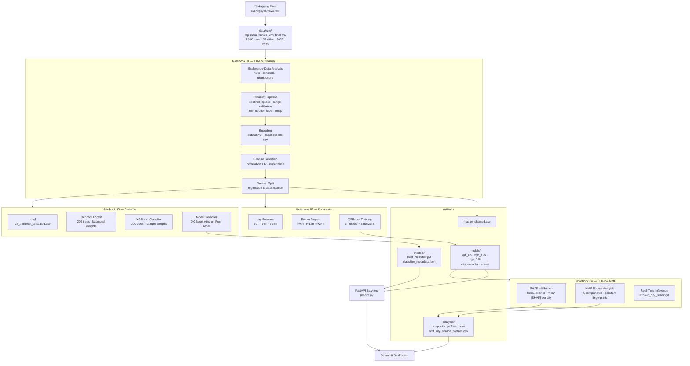

# VAYU — System Overview Pipeline

End-to-end flow from raw data ingestion to model outputs and dashboard.

```mermaid
flowchart TD
    HF["🤗 Hugging Face\nrachitgoyell/vayu-raw"]
    RAW["data/raw/\naqi_india_38cols_knn_final.csv\n846K rows · 29 cities · 2022–2025"]

    subgraph NB1["Notebook 01 — EDA & Cleaning"]
        EDA["Exploratory Data Analysis\nnulls · sentinels · distributions"]
        CLEAN["Cleaning Pipeline\nsentinel replace · range validation\nffill · dedup · label remap"]
        ENCODE["Encoding\nordinal AQI · label-encode city"]
        FEAT_SEL["Feature Selection\ncorrelation + RF importance"]
        SPLIT["Dataset Split\nregression & classification"]
    end

    subgraph NB2["Notebook 02 — Forecaster"]
        LAGS["Lag Features\nt-1h · t-6h · t-24h"]
        TARGETS["Future Targets\nt+6h · t+12h · t+24h"]
        XGB_TRAIN["XGBoost Training\n3 models × 3 horizons"]
    end

    subgraph NB3["Notebook 03 — Classifier"]
        CLF_LOAD["Load clf_train/test_unscaled.csv"]
        RF["Random Forest\n200 trees · balanced weights"]
        XGB_CLF["XGBoost Classifier\n300 trees · sample weights"]
        CLF_SELECT["Model Selection\nXGBoost wins on Poor recall"]
    end

    subgraph NB4["Notebook 04 — SHAP & NMF"]
        SHAP["SHAP Attribution\nTreeExplainer · mean |SHAP| per city"]
        NMF["NMF Source Analysis\nK components · pollutant fingerprints"]
        INFER_FN["Real-Time Inference\nexplain_city_reading()"]
    end

    subgraph OUTPUTS["Artifacts"]
        MASTER["master_cleaned.csv"]
        MODELS["models/\nxgb_6h · xgb_12h · xgb_24h\ncity_encoder · scaler"]
        CLF_MODELS["models/\nbest_classifier.pkl\nclassifier_metadata.json"]
        ANALYSIS["analysis/\nshap_city_profiles_*.csv\nnmf_city_source_profiles.csv"]
    end

    API["FastAPI Backend\npredict.py"]
    DASH["Streamlit Dashboard"]

    HF --> RAW --> NB1
    EDA --> CLEAN --> ENCODE --> FEAT_SEL --> SPLIT
    SPLIT --> MASTER
    SPLIT --> NB2
    SPLIT --> NB3
    MASTER --> OUTPUTS
    XGB_TRAIN --> MODELS
    CLF_SELECT --> CLF_MODELS
    MODELS --> NB4
    SHAP --> ANALYSIS
    NMF --> ANALYSIS
    MODELS --> API
    CLF_MODELS --> API
    ANALYSIS --> DASH
    API --> DASH
```
