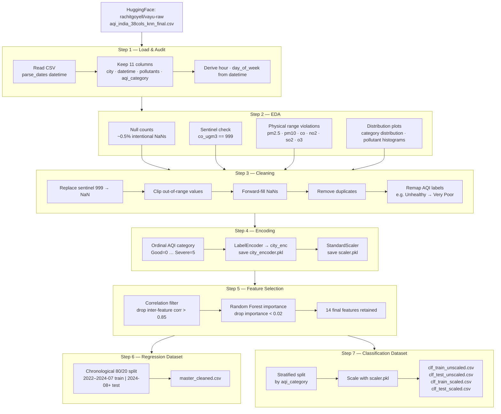
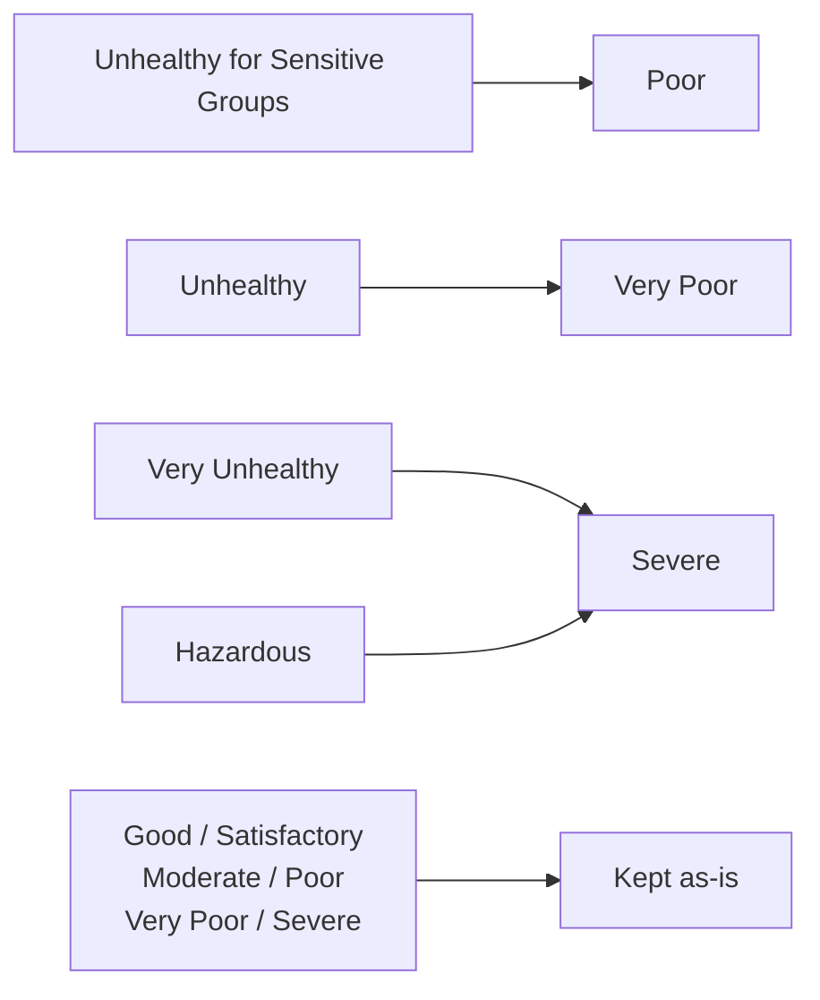
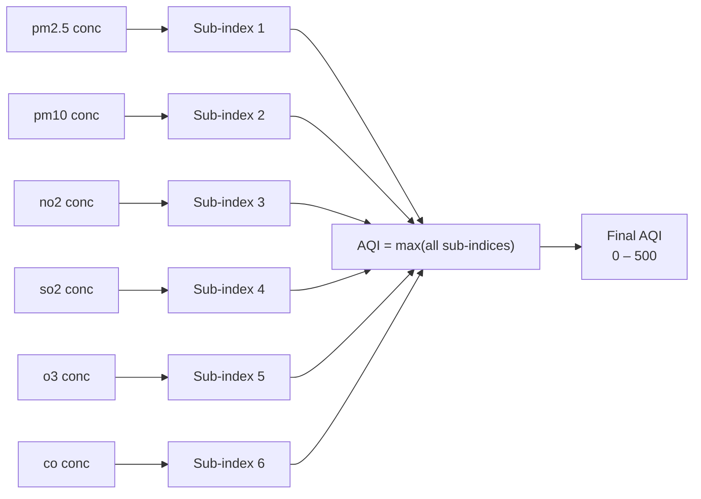

# Notebook 01 — EDA & Data Cleaning Pipeline

Transforms raw AQI data into clean, model-ready datasets for regression and classification.

```mermaid
flowchart TD
    INPUT["HuggingFace: rachitgoyell/vayu-raw\naqi_india_38cols_knn_final.csv"]

    subgraph STEP1["Step 1 — Load & Audit"]
        LOAD["Read CSV\nparse_dates datetime"]
        KEEP["Keep 11 columns\ncity · datetime · pollutants · aqi_category"]
        DERIVE["Derive hour · day_of_week from datetime"]
    end

    subgraph STEP2["Step 2 — EDA"]
        NULLS["Null counts\n~0.5% intentional NaNs"]
        SENTINEL["Sentinel check\nco_ugm3 == 999"]
        RANGE["Physical range violations\npm2.5 · pm10 · co · no2 · so2 · o3"]
        DIST["Distribution plots\ncategory distribution · pollutant histograms"]
    end

    subgraph STEP3["Step 3 — Cleaning"]
        SENT_REPLACE["Replace sentinel 999 → NaN"]
        RANGE_CLIP["Clip out-of-range values"]
        FFILL["Forward-fill NaNs"]
        DEDUP["Remove duplicates"]
        REMAP["Remap AQI labels\ne.g. Unhealthy → Very Poor"]
    end

    subgraph STEP4["Step 4 — Encoding"]
        ORD["Ordinal AQI category\nGood=0 … Severe=5"]
        LENC["LabelEncoder → city_enc\nsave city_encoder.pkl"]
        SCALER["StandardScaler\nsave scaler.pkl"]
    end

    subgraph STEP5["Step 5 — Feature Selection"]
        CORR["Correlation filter\ndrop inter-feature corr > 0.85"]
        RF_IMP["Random Forest importance\ndrop importance < 0.02"]
        FINAL14["14 final features retained"]
    end

    subgraph STEP6["Step 6 — Regression Dataset"]
        CHRONO["Chronological 80/20 split\n2022–2024-07 train | 2024-08+ test"]
        MASTER_OUT["master_cleaned.csv"]
    end

    subgraph STEP7["Step 7 — Classification Dataset"]
        STRAT["Stratified split\nby aqi_category"]
        SCALE_CLF["Scale with scaler.pkl"]
        CLF_OUT["clf_train_unscaled.csv\nclf_test_unscaled.csv\nclf_train_scaled.csv\nclf_test_scaled.csv"]
    end

    INPUT --> STEP1
    LOAD --> KEEP --> DERIVE
    STEP1 --> STEP2
    NULLS & SENTINEL & RANGE & DIST --> STEP3
    SENT_REPLACE --> RANGE_CLIP --> FFILL --> DEDUP --> REMAP
    STEP3 --> STEP4
    ORD --> LENC --> SCALER
    STEP4 --> STEP5
    CORR --> RF_IMP --> FINAL14
    STEP5 --> STEP6
    STEP5 --> STEP7
    CHRONO --> MASTER_OUT
    STRAT --> SCALE_CLF --> CLF_OUT
```

## AQI Category Mapping

```mermaid
flowchart LR
    A["Unhealthy for Sensitive Groups"] --> P["Poor"]
    B["Unhealthy"] --> VP["Very Poor"]
    C["Very Unhealthy"] --> S["Severe"]
    D["Hazardous"] --> S
    E["Good / Satisfactory\nModerate / Poor\nVery Poor / Severe"] --> KEEP["Kept as-is"]
```

## CPCB AQI Computation

```mermaid
flowchart LR
    P1["pm2.5 conc"] --> SI1["Sub-index 1"]
    P2["pm10 conc"]  --> SI2["Sub-index 2"]
    P3["no2 conc"]   --> SI3["Sub-index 3"]
    P4["so2 conc"]   --> SI4["Sub-index 4"]
    P5["o3 conc"]    --> SI5["Sub-index 5"]
    P6["co conc"]    --> SI6["Sub-index 6"]

    SI1 & SI2 & SI3 & SI4 & SI5 & SI6 --> MAX["AQI = max(all sub-indices)"]
    MAX --> AQI_OUT["Final AQI\n0 – 500"]
```
