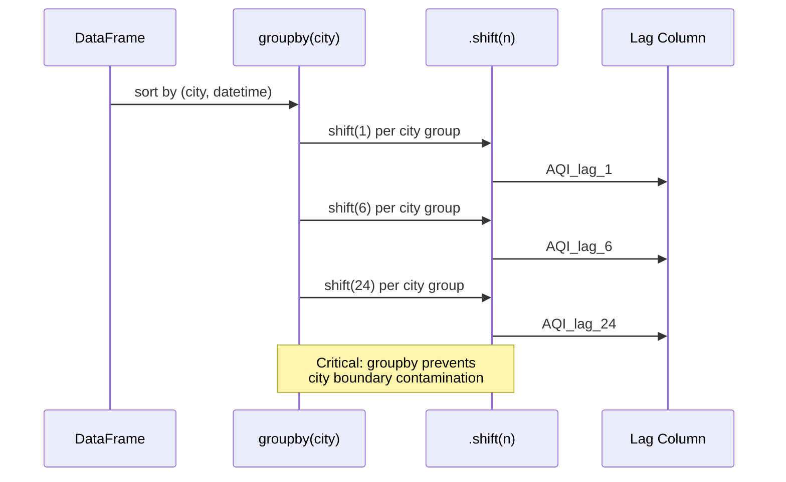
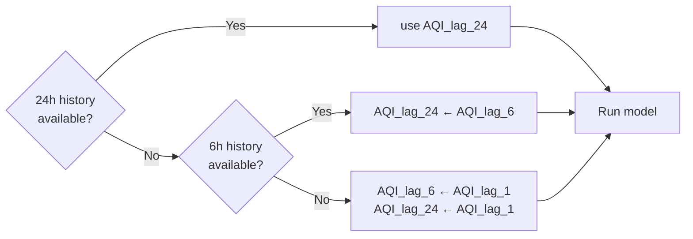
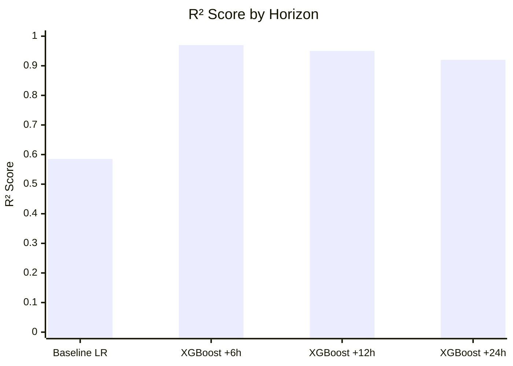

# Notebook 02 — AQI Forecaster Pipeline

Trains three XGBoost regressors to predict AQI at +6h, +12h, and +24h horizons.

## Full Training Pipeline

```mermaid
flowchart TD
    INPUT["master_cleaned.csv\n846K rows · 29 cities"]

    S1["Step 1 — Load & Audit\nread CSV · validate columns"]
    S2["Step 2 — Set AQI column\nus_aqi → AQI alias"]
    S3["Step 3 — Sort chronologically\ngroupby city + datetime\nprevent city-boundary bleed"]
    S3B["Step 3b — Encode city\nLabelEncoder → city_enc\nsave city_encoder.pkl"]
    S3C["Step 3c — Create is_weekend\nday_of_week ≥ 5 → 1"]

    subgraph LAG["Step 4 — Lag Features (within city group)"]
        L1["AQI_lag_1\n1 hour ago"]
        L6["AQI_lag_6\n6 hours ago"]
        L24["AQI_lag_24\n24 hours ago"]
    end

    subgraph TARGET["Step 5 — Future Targets"]
        T6["AQI_next_6\nt + 6h"]
        T12["AQI_next_12\nt + 12h"]
        T24["AQI_next_24\nt + 24h"]
    end

    S6["Step 6 — Drop non-model columns\ncity · state · datetime · geo\nderived categoricals · environmental extras"]

    subgraph FEATURES["Step 7 — FINAL_FEATURES (14 columns)"]
        F_POLL["Pollutants × 6\npm2.5 · pm10 · co · no2 · so2 · o3"]
        F_TIME["Time × 4\nhour · day_of_week · month · is_weekend"]
        F_LOC["Location × 1\ncity_enc"]
        F_LAG["Lag history × 3\nAQI_lag_1 · AQI_lag_6 · AQI_lag_24"]
    end

    S8["Step 8 — Drop NaN rows\n~700 rows lost at city time-series edges"]
    S9["Step 9 — Define X and y arrays\n3 separate y arrays · shared X"]

    subgraph SPLIT["Step 10 — Chronological 80/20 Split"]
        TRAIN_PERIOD["TRAIN 80%\n2022-01 → 2024-07"]
        TEST_PERIOD["TEST 20%\n2024-08 → 2025"]
    end

    S11["Step 11 — Baseline\nLinear Regression\nR²=0.585 · RMSE=45.14"]

    subgraph XGB["Step 12 — XGBoost Training (3 models)"]
        M6["xgb_6h\nR² ~0.97"]
        M12["xgb_12h\nR² ~0.95"]
        M24["xgb_24h\nR² ~0.92"]
    end

    S13["Step 13 — Evaluate\nR² · RMSE · MAE per horizon"]
    S14["Step 14 — Save\nxgb_6h.pkl · xgb_12h.pkl · xgb_24h.pkl\nforecast_features.pkl · features.pkl"]

    INPUT --> S1 --> S2 --> S3 --> S3B --> S3C
    S3C --> LAG
    S3C --> TARGET
    LAG --> S6
    TARGET --> S6
    S6 --> FEATURES
    FEATURES --> S8 --> S9 --> SPLIT
    SPLIT --> S11
    SPLIT --> XGB
    XGB --> S13 --> S14
```

## Lag Feature Construction Logic

## Cold Start Fallback (Inference Time)

## Model Comparison

