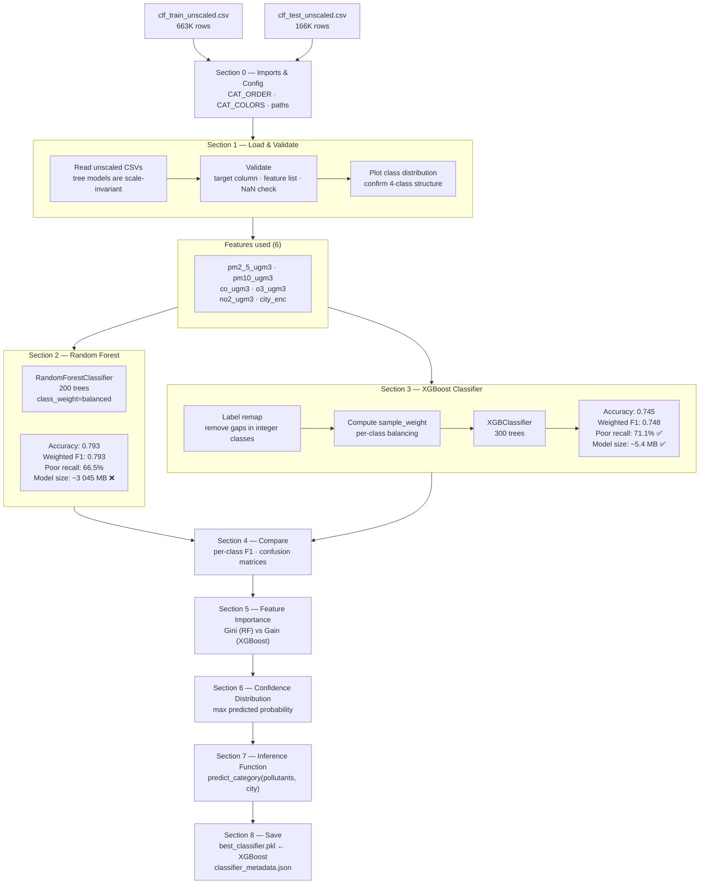
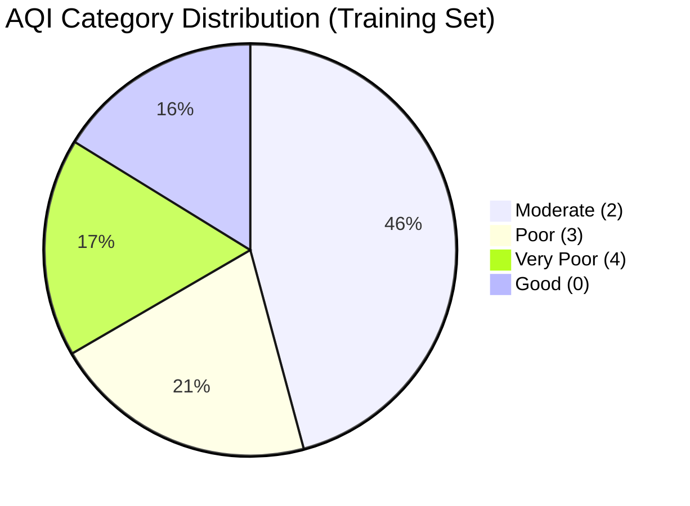
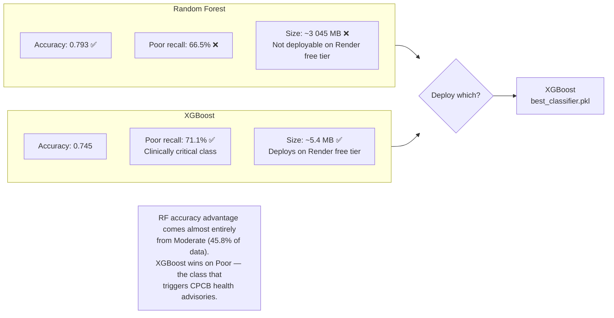
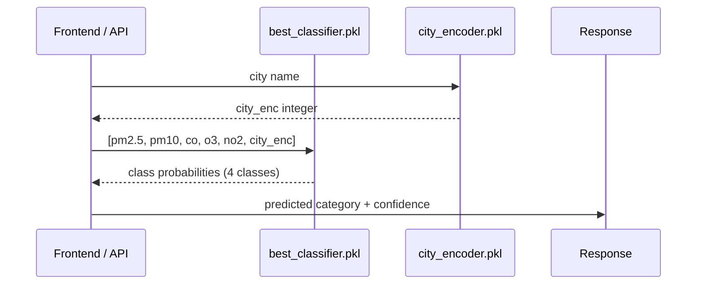

# Notebook 03 — AQI Category Classifier Pipeline

Trains a multi-class classifier to predict CPCB AQI category from current pollutant readings.

## Training Pipeline

## Class Distribution

## Model Selection Decision

## Inference Flow (Production)

