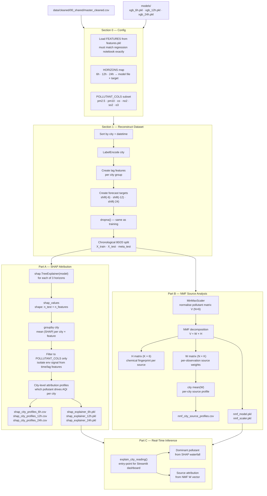
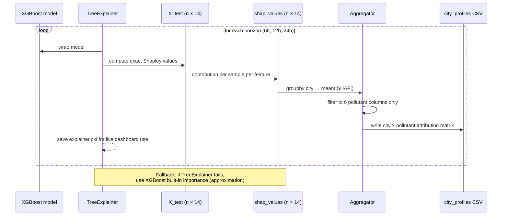
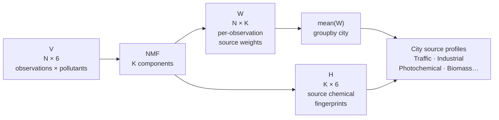
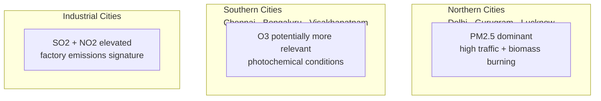
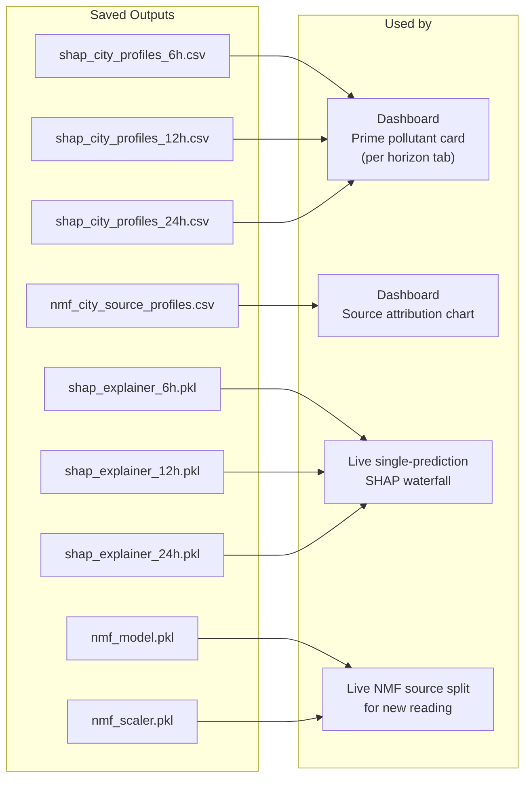

# Notebook 04 — SHAP Attribution & NMF Source Analysis

Adds two interpretability layers on top of the trained XGBoost forecasters.

## Full Pipeline

## Part A — SHAP Value Computation

## Part B — NMF Matrix Factorisation

## Expected SHAP Findings by Geography

## Output Artefacts & Consumers

