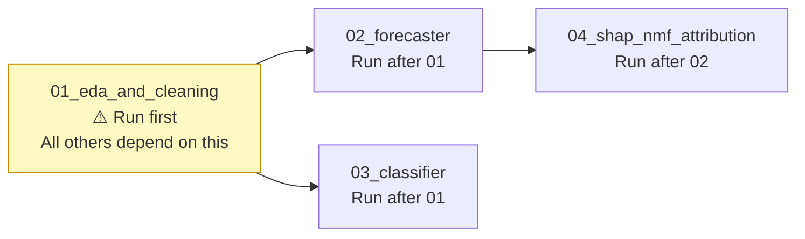
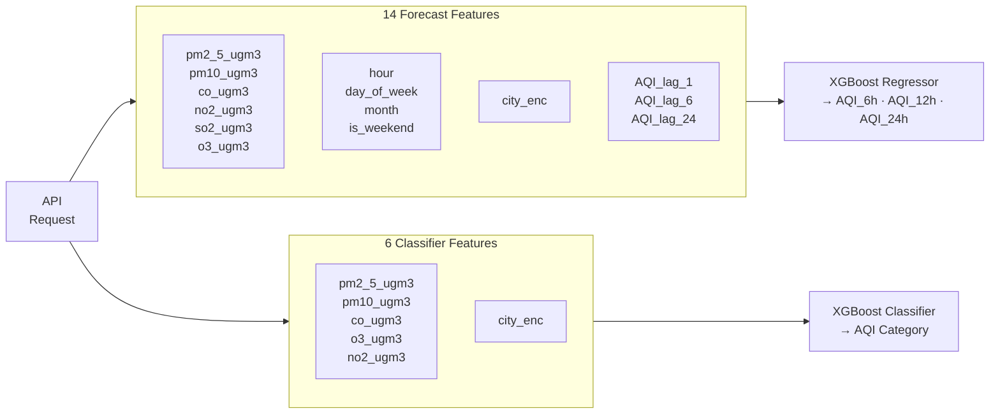

# VAYU — Data Flow & File Dependency Map

Which files are produced and consumed across all notebooks.

## File Dependency Graph

```mermaid
flowchart TD
    HF["🤗 Hugging Face Dataset"]

    subgraph RAW["Raw"]
        RAW_CSV["data/raw/\naqi_india_38cols_knn_final.csv"]
    end

    subgraph NB1_OUT["Notebook 01 outputs"]
        MASTER["data/cleaned/00_shared/\nmaster_cleaned.csv"]
        CLF_TR["data/cleaned/01_classification/\nclf_train_unscaled.csv"]
        CLF_TE["data/cleaned/01_classification/\nclf_test_unscaled.csv"]
        CLF_SC_TR["clf_train_scaled.csv"]
        CLF_SC_TE["clf_test_scaled.csv"]
        CITY_ENC["models/city_encoder.pkl"]
        SCALER["models/scaler.pkl"]
        FEAT_LIST["data/cleaned/01_classification/\nfeature_list.txt"]
    end

    subgraph NB2_OUT["Notebook 02 outputs"]
        XGB6["models/xgb_6h.pkl"]
        XGB12["models/xgb_12h.pkl"]
        XGB24["models/xgb_24h.pkl"]
        FEAT_PKL["models/features.pkl"]
        FORE_FEAT["models/forecast_features.pkl"]
        CITY_ENC2["models/city_encoder.pkl\n(refreshed)"]
    end

    subgraph NB3_OUT["Notebook 03 outputs"]
        BEST_CLF["models/best_classifier.pkl\n(XGBoost)"]
        RF_CLF["models/rf_classifier.pkl"]
        XGB_CLF["models/xgb_classifier.pkl"]
        CLF_META["models/classifier_metadata.json"]
    end

    subgraph NB4_OUT["Notebook 04 outputs"]
        SHAP6["analysis/shap_city_profiles_6h.csv"]
        SHAP12["analysis/shap_city_profiles_12h.csv"]
        SHAP24["analysis/shap_city_profiles_24h.csv"]
        NMF_CSV["analysis/nmf_city_source_profiles.csv"]
        SHAP_EXP6["models/shap_explainer_6h.pkl"]
        SHAP_EXP12["models/shap_explainer_12h.pkl"]
        SHAP_EXP24["models/shap_explainer_24h.pkl"]
        NMF_PKL["models/nmf_model.pkl"]
        NMF_SCALER["models/nmf_scaler.pkl"]
    end

    subgraph BACKEND["FastAPI Backend"]
        API_FORE["Forecast endpoint\n/predict/aqi"]
        API_CLF["Classify endpoint\n/predict/category"]
        API_HEALTH["Health endpoint\n/health"]
    end

    subgraph FRONTEND["Streamlit Dashboard"]
        CARD_FORE["AQI Forecast cards\n+6h · +12h · +24h"]
        CARD_CLF["Category prediction"]
        CARD_SHAP["Prime pollutant card"]
        CARD_NMF["Source attribution chart"]
    end

    HF --> RAW_CSV --> NB1_OUT

    MASTER --> NB2_OUT
    MASTER --> NB4_OUT

    CLF_TR & CLF_TE --> NB3_OUT
    FEAT_LIST --> NB3_OUT

    XGB6 & XGB12 & XGB24 --> NB4_OUT
    FEAT_PKL --> NB4_OUT

    XGB6 & XGB12 & XGB24 & CITY_ENC2 & FORE_FEAT --> API_FORE
    BEST_CLF & CITY_ENC --> API_CLF

    API_FORE --> CARD_FORE
    API_CLF --> CARD_CLF
    SHAP6 & SHAP12 & SHAP24 & SHAP_EXP6 & SHAP_EXP12 & SHAP_EXP24 --> CARD_SHAP
    NMF_CSV & NMF_PKL & NMF_SCALER --> CARD_NMF
```

## Notebook Execution Order

```mermaid
flowchart LR
    N1["01_eda_and_cleaning\n⚠️ Run first\nAll others depend on this"]
    N2["02_forecaster\nRun after 01"]
    N3["03_classifier\nRun after 01"]
    N4["04_shap_nmf_attribution\nRun after 02"]

    N1 --> N2
    N1 --> N3
    N2 --> N4

    style N1 fill:#fef9c3,stroke:#ca8a04
```

## Feature Vector at Inference Time

```mermaid
flowchart LR
    subgraph FORECAST_FEATURES["14 Forecast Features"]
        direction TB
        G1["pm2_5_ugm3\npm10_ugm3\nco_ugm3\nno2_ugm3\nso2_ugm3\no3_ugm3"]
        G2["hour\nday_of_week\nmonth\nis_weekend"]
        G3["city_enc"]
        G4["AQI_lag_1\nAQI_lag_6\nAQI_lag_24"]
    end

    subgraph CLF_FEATURES["6 Classifier Features"]
        direction TB
        C1["pm2_5_ugm3\npm10_ugm3\nco_ugm3\no3_ugm3\nno2_ugm3"]
        C2["city_enc"]
    end

    API_IN["API\nRequest"] --> FORECAST_FEATURES --> XGB_R["XGBoost Regressor\n→ AQI_6h · AQI_12h · AQI_24h"]
    API_IN --> CLF_FEATURES --> XGB_C["XGBoost Classifier\n→ AQI Category"]
```
